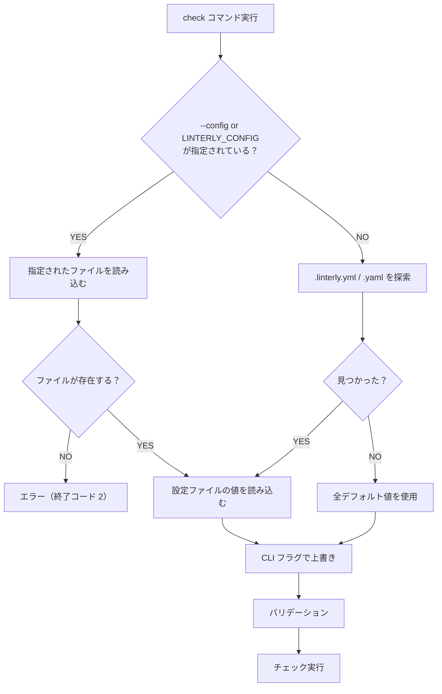

# 設定ファイルスキーマ

## 1. 設定ファイル（`.linterly.yml`）

### 1.1 完全な設定例

```yaml
# チェックルール
rules:
  max_lines_per_file: 300
  max_lines_per_directory: 2000
  warning_threshold: 10          # %（デフォルト: 10）

# 行数カウントモード
count_mode: all                  # all | code_only
# code_only: コメント・空行を除外してカウント

# 除外パターン（.linterlyignore が無い場合に使用）
ignore:
  - "vendor/**"
  - "generated/**"
  - "*.pb.go"

# デフォルト除外の有効/無効
default_excludes: true           # デフォルト: true

# 出力言語
language: en                     # en | ja（デフォルト: en）
```

### 1.2 フィールド定義

#### `rules`

| フィールド | 型 | 必須 | デフォルト | 説明 |
|-----------|-----|------|-----------|------|
| `max_lines_per_file` | integer | いいえ | `300` | 1ファイルあたりの最大行数 |
| `max_lines_per_directory` | integer | いいえ | `2000` | ディレクトリ直下ファイルの合計最大行数 |
| `warning_threshold` | integer | いいえ | `10` | 警告閾値（%）。超過率がこの値以内なら warn、超えたら error |

- `max_lines_per_file` と `max_lines_per_directory` は 1 以上の整数であること。0 以下はバリデーションエラー
- `warning_threshold` は 0〜100 の整数。0 の場合はすべて error として扱う

#### `count_mode`

| 値 | 説明 |
|-----|------|
| `all` | 全行数をカウントする（コメント・空行を含む）。デフォルト |
| `code_only` | コメント行・空行を除外してカウントする。言語ごとのコメント構文に基づく |

#### `ignore`

| フィールド | 型 | 必須 | デフォルト | 説明 |
|-----------|-----|------|-----------|------|
| `ignore` | string[] | いいえ | `[]` | 除外パターン（gitignore 形式） |

- `.linterlyignore` が存在する場合、このフィールドは無視される
- `.linterlyignore` とこのフィールドが両方存在する場合は warn を出力する

#### `default_excludes`

| フィールド | 型 | 必須 | デフォルト | 説明 |
|-----------|-----|------|-----------|------|
| `default_excludes` | boolean | いいえ | `true` | デフォルト除外リストの有効/無効 |

- `true`: 機能要件で定義されたデフォルト除外リストを適用する
- `false`: デフォルト除外リストを無効化し、明示的に指定されたパターンのみで除外する

#### `language`

| フィールド | 型 | 必須 | デフォルト | 説明 |
|-----------|-----|------|-----------|------|
| `language` | string | いいえ | `en` | CLI 出力メッセージの言語 |

- 対応値: `en`（英語）、`ja`（日本語）
- 未対応の値が指定された場合はバリデーションエラー

### 1.3 最小構成

設定ファイルを使用する場合、`rules` セクションは必須だが、各フィールドはすべて省略可能（デフォルト値が適用される）。以下は明示的に値を指定した例:

```yaml
rules:
  max_lines_per_file: 300
```

最小構成では以下のデフォルト値が適用される：

| フィールド | 適用されるデフォルト値 |
|-----------|-------------------|
| `rules.max_lines_per_directory` | `2000` |
| `rules.warning_threshold` | `10` |
| `count_mode` | `all` |
| `ignore` | `[]` |
| `default_excludes` | `true` |
| `language` | `en` |

### 1.4 設定ファイルなしでの動作

設定ファイルが見つからない場合（かつ `--config` で明示指定されていない場合）、エラーにせず全デフォルト値で動作する。

```bash
# 設定ファイルなしでも動作する
$ linterly check
$ linterly check --max-lines-per-file 500
```

`--config` または `LINTERLY_CONFIG` で明示的にパスを指定した場合、そのファイルが存在しなければ従来通りエラーとなる。

### 1.5 バリデーションルール

バリデーションは設定ファイルの値と CLI フラグの値がマージされた最終的な設定に対して行われる。

| ルール | エラーメッセージ（en） |
|--------|---------------------|
| `max_lines_per_file` が 0 以下 | `"max_lines_per_file" must be a positive integer` |
| `max_lines_per_directory` が 0 以下 | `"max_lines_per_directory" must be a positive integer` |
| `warning_threshold` が 0〜100 の範囲外 | `"warning_threshold" must be between 0 and 100` |
| `count_mode` が不正な値 | `"count_mode" must be "all" or "code_only"` |
| `language` が不正な値 | `"language" must be "en" or "ja"` |

> **注記**: 設定ファイルなしで動作する場合、`rules` セクション未定義のバリデーションは適用されない（全デフォルト値が使用されるため）。設定ファイルが存在する場合のみ `rules` セクションは必須。

## 2. ignore ファイル（`.linterlyignore`）

### 2.1 形式

gitignore と同じ形式を採用する。

```gitignore
# コメント
vendor/
generated/
*.pb.go
!important.pb.go

# テストフィクスチャ
testdata/
```

### 2.2 構文ルール

| 構文 | 説明 | 例 |
|------|------|-----|
| `#` | コメント行 | `# これはコメント` |
| `pattern` | ファイル/ディレクトリを除外 | `vendor/` |
| `*` | 任意の文字列にマッチ（`/` を除く） | `*.log` |
| `**` | 任意のディレクトリ階層にマッチ | `**/test/` |
| `!pattern` | 除外の取り消し（再include） | `!important.go` |
| 末尾 `/` | ディレクトリのみにマッチ | `build/` |

### 2.3 優先ルール

```mermaid
graph TD
    A{".linterlyignore が存在する？"}
    A -->|YES| B["`.linterlyignore` を使用"]
    A -->|NO| C["設定ファイルの `ignore` を使用"]
    B --> D{"設定ファイルにも `ignore` がある？"}
    D -->|YES| E["warn を出力<br/>「.linterlyignore が優先されます」"]
    D -->|NO| F["そのまま続行"]
    C --> G{"`ignore` が未設定？"}
    G -->|YES| H["除外なし（デフォルト除外のみ）"]
    G -->|NO| I["設定ファイルの `ignore` パターンを適用"]
```

## 3. 設定の解決フロー

### 3.1 設定ファイルの探索順序

以下の優先順序で設定ファイルを探索する：

1. `--config` フラグで指定されたパス
2. `LINTERLY_CONFIG` 環境変数で指定されたパス
3. カレントディレクトリの `.linterly.yml`
4. カレントディレクトリの `.linterly.yaml`

- `--config` または `LINTERLY_CONFIG` で指定されたファイルが存在しない場合はエラー（終了コード 2）
- 上記のいずれも指定されず、自動探索でも見つからない場合は**全デフォルト値で動作する**（エラーにならない）

`.linterlyignore` は常にカレントディレクトリから探索する。`--config` でパスを指定した場合でも、`.linterlyignore` はカレントディレクトリが基準となる。

### 3.2 CLI フラグによる上書き

CLI フラグで指定された値は、設定ファイルの値を上書きする。

```
CLI フラグ > 環境変数 > 設定ファイル > デフォルト値
```

| CLI フラグ | 対応する設定ファイルフィールド | デフォルト値 |
|-----------|--------------------------|------------|
| `--max-lines-per-file` | `rules.max_lines_per_file` | `300` |
| `--max-lines-per-directory` | `rules.max_lines_per_directory` | `2000` |
| `--warning-threshold` | `rules.warning_threshold` | `10` |
| `--count-mode` | `count_mode` | `all` |
| `--ignore` | `ignore` | `[]` |
| `--no-default-excludes` | `default_excludes: false` | `true` |
| `--lang` | `language` | `en` |

#### 上書きルール

- 数値・文字列フラグ: 指定された場合、設定ファイルの値を完全に置き換える
- `--ignore`: 1回以上指定された場合、設定ファイルの `ignore` を完全に置き換える（マージではない）
- `--no-default-excludes`: 指定された場合、`default_excludes` を `false` に設定する

### 3.3 設定解決フロー図



## 4. `linterly init` で生成されるデフォルト設定

```yaml
# Linterly 設定ファイル
# https://github.com/ousiassllc/linterly

rules:
  max_lines_per_file: 300
  max_lines_per_directory: 2000
  warning_threshold: 10

count_mode: all

# default_excludes: true
# language: en
```

## 改訂履歴

| 版 | 日付 | 変更内容 | 変更理由 |
|---|------|---------|---------|
| 1.0 | 2026-02-08 | 初版作成 | — |
| 1.1 | 2026-02-08 | バリデーション記述の明確化、最小構成の注記追加、探索順序に LINTERLY_CONFIG を追加 | CLI 仕様との整合性確保、記述の正確性向上 |
| 1.2 | 2026-02-08 | `max_lines_per_file` のデフォルト値を 400 → 300 に変更 | デフォルト値の見直し |
| 1.3 | 2026-02-08 | 設定ファイル未発見時のエラーメッセージ例を追加 | ドキュメント乖離レポート (#3) 対応 |
| 1.4 | 2026-02-24 | 設定ファイルなし動作の追加、CLI フラグによる上書きセクション追加、設定解決フロー図追加、バリデーションルールの rules 必須条件を条件付きに変更 | #22 CLI フラグによる設定値の上書き対応 |
