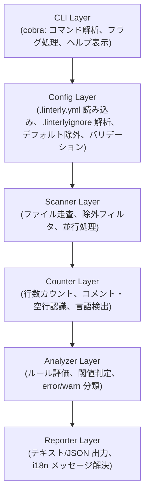
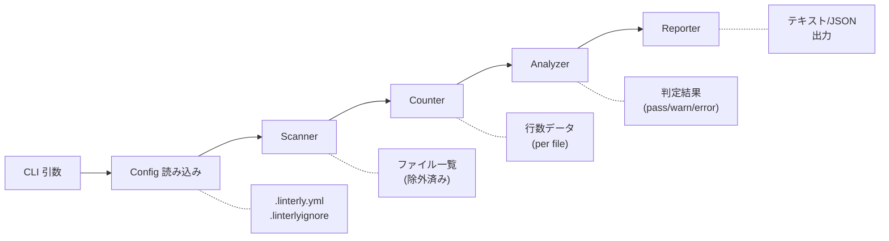
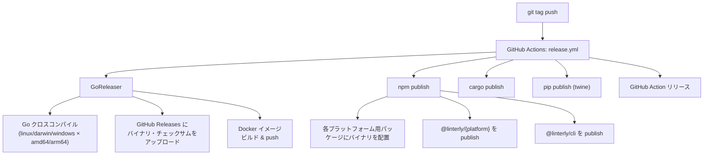

# アーキテクチャ設計

## 1. 全体構成



※ 上記は概念的なデータフローを示す。実際のコンポーネント間の呼び出し関係はコンポーネント設計を参照。

## 2. 技術選定

| カテゴリ | 技術 | 理由 |
|---------|------|------|
| 言語 | Go 1.24+ | シングルバイナリ、クロスコンパイル、並行処理が容易 |
| CLI フレームワーク | [cobra](https://github.com/spf13/cobra) | Go CLI ツールのデファクトスタンダード |
| 設定ファイル | [viper](https://github.com/spf13/viper) | YAML 読み込み、デフォルト値管理に強い |
| ignore パーサー | [go-gitignore](https://github.com/denormal/go-gitignore) | gitignore 形式のパターンマッチ |
| テスト | 標準 `testing` + [testify](https://github.com/stretchr/testify) | アサーション、モック |
| ビルド | [GoReleaser](https://goreleaser.com/) | クロスコンパイル、GitHub Releases、配布自動化 |
| CI/CD | GitHub Actions | ビルド、テスト、リリース自動化 |

## 3. パッケージ構成

```
linterly/
├── cmd/                    # CLI エントリポイント
│   └── linterly/
│       └── main.go
├── internal/               # 内部パッケージ（外部公開しない）
│   ├── cli/                # CLI Layer: コマンド定義
│   │   ├── root.go         #   ルートコマンド（ヘルプ表示）
│   │   ├── check.go        #   check サブコマンド
│   │   ├── init.go         #   init サブコマンド
│   │   └── version.go      #   version サブコマンド
│   ├── config/             # Config Layer: 設定管理
│   │   ├── config.go       #   設定ファイル読み込み・バリデーション
│   │   ├── ignore.go       #   ignore ファイル処理・優先ルール
│   │   └── defaults.go     #   デフォルト除外リスト
│   ├── scanner/            # Scanner Layer: ファイル走査
│   │   └── scanner.go      #   ディレクトリ走査・除外フィルタ
│   ├── counter/            # Counter Layer: 行数カウント
│   │   ├── counter.go      #   行数カウントロジック
│   │   └── language.go     #   言語検出・コメント構文定義
│   ├── analyzer/           # Analyzer Layer: ルール評価
│   │   └── analyzer.go     #   閾値判定・結果分類
│   ├── reporter/           # Reporter Layer: 出力
│   │   ├── text.go         #   テキスト出力
│   │   └── json.go         #   JSON 出力
│   └── i18n/               # 国際化
│       ├── i18n.go         #   メッセージ解決
│       └── messages/       #   メッセージファイル
│           ├── en.yml
│           └── ja.yml
├── pkg/                    # 公開パッケージ（将来的にライブラリ利用を想定）
├── testdata/               # テスト用フィクスチャ
├── dist/                   # npm/cargo/pip ラッパー
│   ├── npm/
│   │   ├── cli/            #   @linterly/cli（メインパッケージ）
│   │   │   ├── package.json
│   │   │   └── bin.js      #   プラットフォーム別バイナリ実行ラッパー
│   │   ├── darwin-arm64/   #   @linterly/darwin-arm64
│   │   │   └── package.json
│   │   ├── darwin-x64/     #   @linterly/darwin-x64
│   │   │   └── package.json
│   │   ├── linux-arm64/    #   @linterly/linux-arm64
│   │   │   └── package.json
│   │   ├── linux-x64/      #   @linterly/linux-x64
│   │   │   └── package.json
│   │   └── win32-x64/      #   @linterly/win32-x64
│   │       └── package.json
│   ├── cargo/              #   crates.io ラッパー
│   ├── pip/                #   PyPI ラッパー
│   └── docker/
│       └── Dockerfile
├── .github/
│   └── workflows/
│       ├── ci.yml          # テスト・Lint
│       └── release.yml     # リリース自動化
├── .linterly.yml           # 自分自身のチェック用設定
├── .goreleaser.yml         # GoReleaser 設定
├── go.mod
├── go.sum
└── README.md
```

## 4. データフロー



### 処理フロー詳細

1. **CLI 引数パース**: cobra がコマンド・フラグを解析
2. **設定読み込み**: viper が `.linterly.yml` を読み込み、デフォルト値とマージ
3. **ignore 解決**: `.linterlyignore` の存在確認 → 優先ルール適用 → 重複警告
4. **ファイル走査**: 対象パスを再帰走査、除外パターン・デフォルト除外を適用
5. **行数カウント**: 各ファイルの行数をカウント（モードに応じてコメント・空行を除外）
6. **ディレクトリ集計**: ディレクトリ直下ファイルの行数を合計（サブディレクトリ除外）
7. **ルール評価**: 設定値・閾値と比較し、pass / warn / error を判定
8. **結果出力**: 指定フォーマットで結果を出力
9. **終了コード**: error があれば 1、なければ 0

## 5. ビルド・配布パイプライン



### リリースフロー

1. `git tag v1.0.0` → push
2. GitHub Actions がトリガーされる
3. GoReleaser がクロスコンパイル + GitHub Releases に publish
4. 各パッケージマネージャ向けのラッパーにバイナリを配置して publish
5. Docker イメージをビルドして GHCR に push

## 改訂履歴

| 版 | 日付 | 変更内容 | 変更理由 |
|---|------|---------|---------|
| 1.0 | 2026-02-08 | 初版作成 | — |
| 1.1 | 2026-02-08 | ASCII 図を mermaid に置き換え | 可読性向上 |
| 1.2 | 2026-02-08 | パッケージ構成に version.go を追加、レイヤー図に注記を追加 | CLI 仕様・コンポーネント設計との整合性確保 |
| 1.3 | 2026-02-08 | Go バージョンを 1.24+ に更新 | ドキュメント乖離レポート (#3) 対応 |
