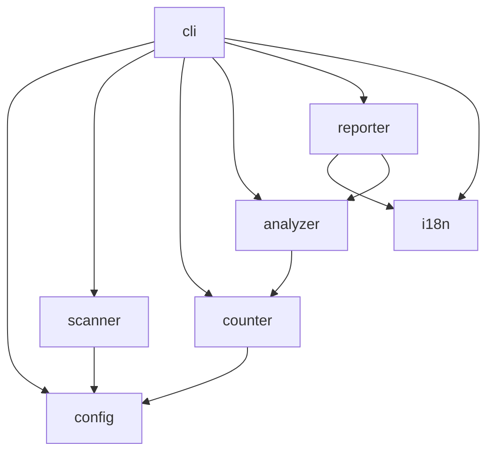
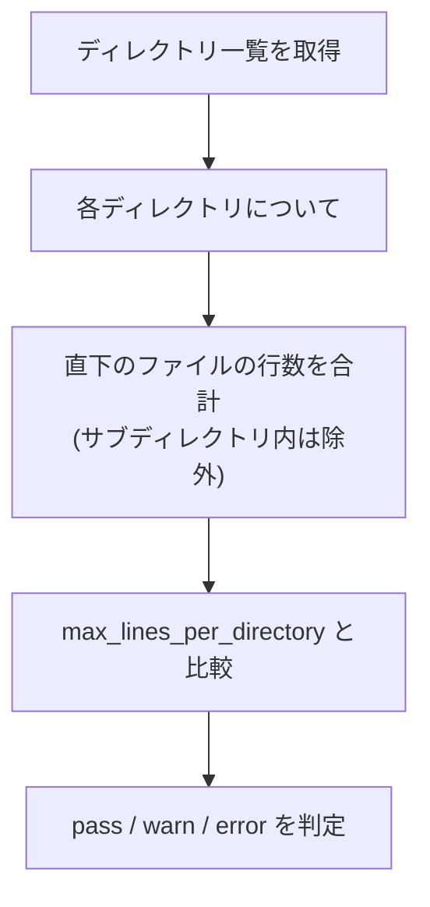
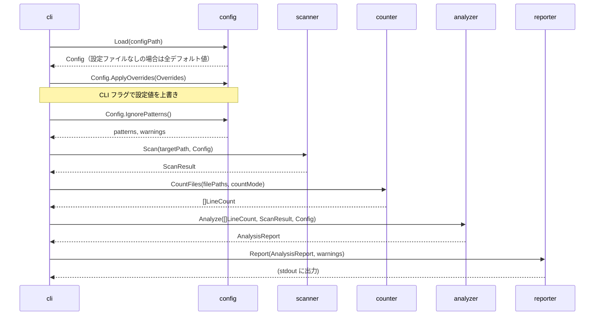

# コンポーネント設計

## 1. コンポーネント構成



## 2. コンポーネント詳細

### 2.1 cli

**責務**: CLI のエントリポイント。コマンド・フラグの定義と、各コンポーネントの呼び出しを行う。

**依存**: config, scanner, analyzer, reporter

**パッケージ**: `internal/cli`

| ファイル | 責務 |
|---------|------|
| `root.go` | ルートコマンド定義。引数なしでヘルプを表示 |
| `check.go` | check サブコマンド。CLI フラグの定義、チェックフローの実行を統括 |
| `init.go` | init サブコマンド。設定ファイルの生成 |
| `version.go` | バージョン情報表示 |

#### CLI フラグ（check コマンド）

```go
// 既存フラグ
var configFile string  // --config
var format string      // --format

// 設定上書きフラグ
var maxLinesPerFile int       // --max-lines-per-file
var maxLinesPerDirectory int  // --max-lines-per-directory
var warningThreshold int      // --warning-threshold
var countMode string          // --count-mode
var ignore []string           // --ignore（複数回指定可能）
var noDefaultExcludes bool    // --no-default-excludes
```

#### 主要インターフェース

```go
// check コマンドの実行フロー（check.go 内）
func runCheck(cmd *cobra.Command, args []string) error {
    // 1. config.Load() で設定読み込み（設定ファイルなしでもデフォルト値で動作）
    // 2. config.ApplyOverrides() で CLI フラグの値を上書き＋バリデーション
    // 3. scanner.Scan() でファイル一覧取得
    // 4. analyzer.Analyze() でルール評価
    // 5. reporter.Report() で結果出力
    // 6. 終了コードを返す
}
```

---

### 2.2 config

**責務**: 設定ファイル・ignore ファイルの読み込み、バリデーション、デフォルト値の管理。

**依存**: なし（エラーコードを `ConfigError.Code` に持たせ、CLI 層で i18n 変換する）

**パッケージ**: `internal/config`

| ファイル | 責務 |
|---------|------|
| `config.go` | `.linterly.yml` の読み込み、デフォルト値マージ、バリデーション |
| `ignore.go` | `.linterlyignore` の読み込み、優先ルール判定、重複警告 |
| `defaults.go` | デフォルト除外リストの定義 |

#### 主要インターフェース

```go
// Config は設定ファイルの内容を表す
type Config struct {
    Rules           Rules    `yaml:"rules"`
    CountMode       string   `yaml:"count_mode"`
    Ignore          []string `yaml:"ignore"`
    DefaultExcludes bool     `yaml:"default_excludes"`
    Language        string   `yaml:"language"`
}

type Rules struct {
    MaxLinesPerFile      int `yaml:"max_lines_per_file"`
    MaxLinesPerDirectory int `yaml:"max_lines_per_directory"`
    WarningThreshold     int `yaml:"warning_threshold"`
}

// Overrides は CLI フラグによる設定上書き値を保持する。
// nil のフィールドは「未指定」を意味し、上書きしない。
type Overrides struct {
    MaxLinesPerFile      *int
    MaxLinesPerDirectory *int
    WarningThreshold     *int
    CountMode            *string
    Ignore               []string // nil=未指定、空スライス=空リストで上書き
    NoDefaultExcludes    bool     // true の場合 DefaultExcludes を false に設定
}

// Load は設定ファイルを読み込み、デフォルト値がマージされた Config を返す。
// configPath が空で設定ファイルが見つからない場合は全デフォルト値の Config を返す。
// この時点ではバリデーションは行わない。
func Load(configPath string) (*Config, error)

// ApplyOverrides は CLI フラグの値で Config を上書きし、最終的なバリデーションを行う。
// 不正な値が渡された場合は error を返す。
func (c *Config) ApplyOverrides(o *Overrides) error

// IgnorePatterns は有効な除外パターン一覧を返す
// .linterlyignore が存在すればそちらを優先し、重複時は warn を返す
func (c *Config) IgnorePatterns() (patterns []string, warnings []string, err error)

// DefaultExcludePatterns はデフォルト除外パターン一覧を返す
func DefaultExcludePatterns() []string
```

---

### 2.3 scanner

**責務**: ファイルシステムの走査。除外パターン・デフォルト除外を適用し、チェック対象のファイル一覧を返す。

**依存**: config

**パッケージ**: `internal/scanner`

| ファイル | 責務 |
|---------|------|
| `scanner.go` | ディレクトリ走査、除外フィルタ適用、goroutine による並行処理 |

#### 主要インターフェース

```go
// FileEntry は走査で見つかったファイルの情報
type FileEntry struct {
    Path string // プロジェクトルートからの相対パス
    Dir  string // ファイルが属するディレクトリ
}

// ScanResult は走査結果
type ScanResult struct {
    Files []FileEntry
    Dirs  []string // チェック対象のディレクトリ一覧
}

// Scan は指定パスを走査し、除外パターンを適用した結果を返す
func Scan(targetPath string, cfg *config.Config) (*ScanResult, error)
```

#### 走査ロジック

1. `targetPath` を起点にディレクトリを再帰走査する
2. デフォルト除外パターン（`default_excludes: true` の場合）を適用する
3. ignore パターン（`.linterlyignore` または設定ファイルの `ignore`）を適用する
4. 除外されなかったファイル・ディレクトリを `ScanResult` に格納する

---

### 2.4 counter

**責務**: ファイルの行数カウント。`count_mode` に応じてコメント・空行の除外を行う。

**依存**: config

**パッケージ**: `internal/counter`

| ファイル | 責務 |
|---------|------|
| `counter.go` | 行数カウントロジック。バッファ付き I/O で効率的に処理 |
| `language.go` | ファイル拡張子からの言語検出、各言語のコメント構文定義 |

#### 主要インターフェース

```go
// LineCount はファイルの行数カウント結果
type LineCount struct {
    Path       string
    TotalLines int // 全行数
    CodeLines  int // コード行数（コメント・空行除外）
}

// CountFile は指定ファイルの行数をカウントする
func CountFile(path string, mode string) (*LineCount, error)

// CountFiles は複数ファイルの行数を並行してカウントする
func CountFiles(files []string, mode string) ([]LineCount, error)
```

#### 言語定義

```go
// Language はプログラミング言語のコメント構文を定義する
type Language struct {
    Name             string
    Extensions       []string
    LineCommentStart []string   // 例: ["//", "#"]
    BlockCommentStart string   // 例: "/*"
    BlockCommentEnd   string   // 例: "*/"
}
```

---

### 2.5 analyzer

**責務**: カウント結果とルール設定を比較し、pass / warn / error を判定する。

**依存**: counter

**パッケージ**: `internal/analyzer`

| ファイル | 責務 |
|---------|------|
| `analyzer.go` | ルール評価、閾値判定、ディレクトリ集計（直下ファイルのみ） |

#### 主要インターフェース

```go
// Severity は違反レベル
type Severity string

const (
    SeverityPass  Severity = "pass"
    SeverityWarn  Severity = "warn"
    SeverityError Severity = "error"
)

// Result は1つのチェック結果
type Result struct {
    Path      string   // ファイルまたはディレクトリのパス
    Type      string   // "file" または "directory"
    Lines     int      // 実際の行数
    Limit     int      // 設定上限
    Threshold int      // warn/error 境界値
    Severity  Severity
}

// AnalysisReport は全体のチェック結果
type AnalysisReport struct {
    Results  []Result
    Errors   int
    Warnings int
    Passed   int
}

// Analyze はカウント結果をルール設定と比較し、レポートを返す
func Analyze(counts []counter.LineCount, scanResult *scanner.ScanResult, cfg *config.Config) *AnalysisReport
```

#### ディレクトリ集計ロジック



---

### 2.6 reporter

**責務**: 分析結果をユーザーに出力する。テキスト / JSON 形式に対応し、i18n メッセージを使用する。

**依存**: analyzer, i18n

**パッケージ**: `internal/reporter`

| ファイル | 責務 |
|---------|------|
| `text.go` | テキスト形式の出力。カラー対応（`NO_COLOR` 対応） |
| `json.go` | JSON 形式の出力 |

#### 主要インターフェース

```go
// Reporter は結果出力のインターフェース
type Reporter interface {
    Report(report *analyzer.AnalysisReport, warnings []string) error
}

// NewReporter はフォーマット指定に応じた Reporter を返す
func NewReporter(format string, translator *i18n.Translator, writer io.Writer) Reporter
```

#### テキスト出力のカラー

| Severity | カラー |
|----------|--------|
| `ERROR` | 赤 |
| `WARN` | 黄 |
| `PASS` | 表示しない（violation のみ出力） |

---

### 2.7 i18n

**責務**: CLI 出力メッセージの国際化。英語・日本語に対応する。

**依存**: なし

**パッケージ**: `internal/i18n`

| ファイル | 責務 |
|---------|------|
| `i18n.go` | メッセージキーから翻訳テキストを解決する |
| `messages/en.yml` | 英語メッセージ定義 |
| `messages/ja.yml` | 日本語メッセージ定義 |

#### 主要インターフェース

```go
// Translator はメッセージ翻訳を行う
type Translator struct {
    lang     string
    messages map[string]string
}

// New は指定言語の Translator を生成する
func New(lang string) (*Translator, error)

// T はメッセージキーに対応する翻訳テキストを返す
// args はプレースホルダーの置換に使用する
func (t *Translator) T(key string, args ...any) string

// ResolveLanguage は config 読み込み前に言語を決定する
// 優先順位: flagLang > LINTERLY_LANG 環境変数 > デフォルト "en"
func ResolveLanguage(flagLang string) string
```

#### メッセージファイル例

```yaml
# messages/en.yml
check.warn: "WARN  %s (%d lines, limit: %d)"
check.error: "ERROR %s (%d lines, limit: %d)"
check.summary: "Results: %d error(s), %d warning(s), %d passed"
ignore.both_defined: >-
  Both .linterlyignore and ignore in config file are defined.
  .linterlyignore takes precedence. ignore in config file is ignored.
init.created: "Created .linterly.yml"
init.overwrite: ".linterly.yml already exists. Overwrite? [y/N]:"
init.overwritten: "Overwritten .linterly.yml"
```

```yaml
# messages/ja.yml
check.warn: "WARN  %s (%d 行, 上限: %d)"
check.error: "ERROR %s (%d 行, 上限: %d)"
check.summary: "結果: %d エラー, %d 警告, %d パス"
ignore.both_defined: >-
  .linterlyignore と設定ファイルの ignore が両方定義されています。
  .linterlyignore が優先されます。設定ファイルの ignore は無視されます。
init.created: ".linterly.yml を作成しました"
init.overwrite: ".linterly.yml が既に存在します。上書きしますか？ [y/N]:"
init.overwritten: ".linterly.yml を上書きしました"
```

## 3. コンポーネント間のデータフロー



## 改訂履歴

| 版 | 日付 | 変更内容 | 変更理由 |
|---|------|---------|---------|
| 1.0 | 2026-02-08 | 初版作成 | — |
| 1.1 | 2026-02-08 | cli コンポーネントに version.go を追加、依存関係図に CLI -> Counter を追加 | アーキテクチャ設計・CLI 仕様との整合性確保 |
| 1.2 | 2026-02-08 | Config -> I18n の依存理由を明記 | 整合性チェックによる改善 |
| 1.3 | 2026-02-08 | CountFiles のシグネチャを実装に合わせて修正、NewReporter のシグネチャを更新、Config の i18n 依存を CLI 経由に変更、ResolveLanguage を追加 | ドキュメント乖離レポート (#3) 対応 |
| 1.4 | 2026-02-24 | cli: 設定上書きフラグを追加、config: Overrides 型と ApplyOverrides メソッドを追加、Load の設定ファイルなし動作を更新、シーケンス図に ApplyOverrides ステップを追加 | #22 CLI フラグによる設定値の上書き対応 |
