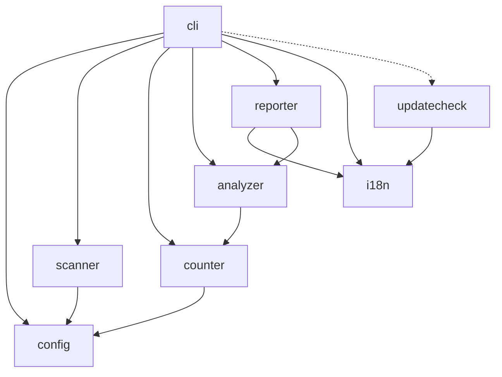
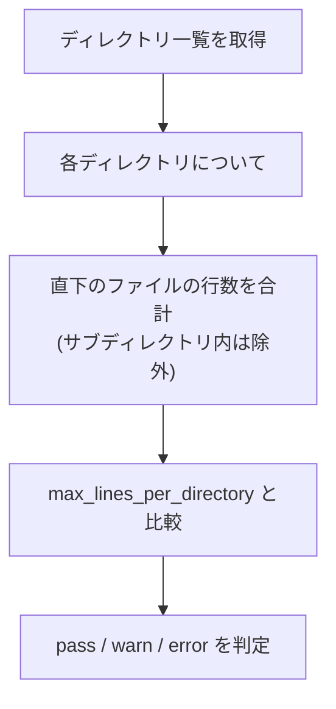
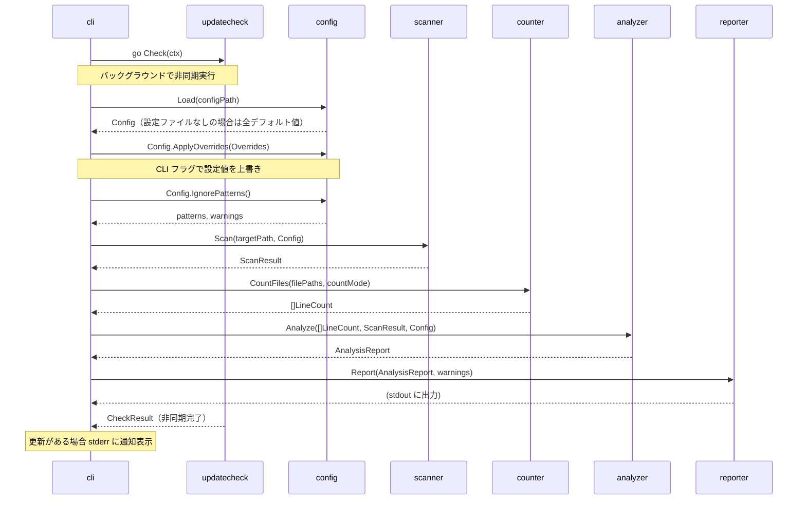

# コンポーネント設計

## 1. コンポーネント構成


```mermaid
graph TD
    CLI["cli"]
    Config["config"]
    Scanner["scanner"]
    Counter["counter"]
    Analyzer["analyzer"]
    Reporter["reporter"]
    I18n["i18n"]
    UC["updatecheck"]

    CLI --> Config
    CLI --> Scanner
    CLI --> Counter
    CLI --> Analyzer
    CLI --> Reporter
    CLI --> I18n
    CLI -.-> UC
    UC --> I18n
    Scanner --> Config
    Counter --> Config
    Analyzer --> Counter
    Reporter --> I18n
    Reporter --> Analyzer
```

## 2. コンポーネント詳細

### 2.1 cli

**責務**: CLI のエントリポイント。コマンド・フラグの定義と、各コンポーネントの呼び出しを行う。

**依存**: config, scanner, analyzer, reporter

**パッケージ**: `internal/cli`

| ファイル | 責務 |
|---------|------|
| `root.go` | ルートコマンド定義。引数なしでヘルプを表示 |
| `check.go` | check サブコマンド。CLI フラグの定義、チェックフローの実行を統括 |
| `init.go` | init サブコマンド。設定ファイルの生成 |
| `version.go` | バージョン情報表示 |

#### CLI フラグ（check コマンド）

```go
// 既存フラグ
var configFile string  // --config
var format string      // --format

// 設定上書きフラグ
var maxLinesPerFile int       // --max-lines-per-file
var maxLinesPerDirectory int  // --max-lines-per-directory
var warningThreshold int      // --warning-threshold
var countMode string          // --count-mode
var ignore []string           // --ignore（複数回指定可能）
var noDefaultExcludes bool    // --no-default-excludes
```

#### 主要インターフェース

```go
// check コマンドの実行フロー（check.go 内）
func runCheck(cmd *cobra.Command, args []string) error {
    // 1. config.Load() で設定読み込み（設定ファイルなしでもデフォルト値で動作）
    // 2. config.ApplyOverrides() で CLI フラグの値を上書き＋バリデーション
    // 3. scanner.Scan() でファイル一覧取得
    // 4. analyzer.Analyze() でルール評価
    // 5. reporter.Report() で結果出力
    // 6. 終了コードを返す
}
```

---

### 2.2 config

**責務**: 設定ファイル・ignore ファイルの読み込み、バリデーション、デフォルト値の管理。

**依存**: なし（エラーコードを `ConfigError.Code` に持たせ、CLI 層で i18n 変換する）

**パッケージ**: `internal/config`

| ファイル | 責務 |
|---------|------|
| `config.go` | `.linterly.yml` の読み込み、デフォルト値マージ、バリデーション |
| `ignore.go` | `.linterlyignore` の読み込み、優先ルール判定、重複警告 |
| `defaults.go` | デフォルト除外リストの定義 |

#### 主要インターフェース

```go
// Config は設定ファイルの内容を表す
type Config struct {
    Rules           Rules    `yaml:"rules"`
    CountMode       string   `yaml:"count_mode"`
    Ignore          []string `yaml:"ignore"`
    DefaultExcludes bool     `yaml:"default_excludes"`
    Language        string   `yaml:"language"`
}

type Rules struct {
    MaxLinesPerFile      int `yaml:"max_lines_per_file"`
    MaxLinesPerDirectory int `yaml:"max_lines_per_directory"`
    WarningThreshold     int `yaml:"warning_threshold"`
}

// Overrides は CLI フラグによる設定上書き値を保持する。
// nil のフィールドは「未指定」を意味し、上書きしない。
type Overrides struct {
    MaxLinesPerFile      *int
    MaxLinesPerDirectory *int
    WarningThreshold     *int
    CountMode            *string
    Ignore               []string // nil=未指定、空スライス=空リストで上書き
    NoDefaultExcludes    bool     // true の場合 DefaultExcludes を false に設定
}

// Load は設定ファイルを読み込み、デフォルト値がマージされた Config を返す。
// configPath が空で設定ファイルが見つからない場合は全デフォルト値の Config を返す。
// この時点ではバリデーションは行わない。
func Load(configPath string) (*Config, error)

// ApplyOverrides は CLI フラグの値で Config を上書きし、最終的なバリデーションを行う。
// 不正な値が渡された場合は error を返す。
func (c *Config) ApplyOverrides(o *Overrides) error

// IgnorePatterns は有効な除外パターン一覧を返す
// .linterlyignore が存在すればそちらを優先し、重複時は warn を返す
func (c *Config) IgnorePatterns() (patterns []string, warnings []string, err error)

// DefaultExcludePatterns はデフォルト除外パターン一覧を返す
func DefaultExcludePatterns() []string
```

---

### 2.3 scanner

**責務**: ファイルシステムの走査。除外パターン・デフォルト除外を適用し、チェック対象のファイル一覧を返す。

**依存**: config

**パッケージ**: `internal/scanner`

| ファイル | 責務 |
|---------|------|
| `scanner.go` | ディレクトリ走査、除外フィルタ適用、goroutine による並行処理 |

#### 主要インターフェース

```go
// FileEntry は走査で見つかったファイルの情報
type FileEntry struct {
    Path string // ターゲットパスからの相対パス
    Dir  string // ファイルが属するディレクトリ（相対パス）
}

// ScanResult は走査結果
type ScanResult struct {
    Files []FileEntry
    Dirs  []string // チェック対象のディレクトリ一覧
}

// Scan は指定パスを走査し、除外パターンを適用した結果を返す
func Scan(targetPath string, cfg *config.Config) (*ScanResult, error)
```

#### 走査ロジック

1. `targetPath` を起点にディレクトリを再帰走査する
2. デフォルト除外パターン（`default_excludes: true` の場合）を適用する
3. ignore パターン（`.linterlyignore` または設定ファイルの `ignore`）を適用する
   - パターンは常にプロジェクトルート（cwd）を基準に評価される
   - サブディレクトリをターゲットに指定した場合も、パターンの評価基準は変わらない
4. 除外されなかったファイル・ディレクトリを `ScanResult` に格納する

---

### 2.4 counter

**責務**: ファイルの行数カウント。`count_mode` に応じてコメント・空行の除外を行う。

**依存**: config

**パッケージ**: `internal/counter`

| ファイル | 責務 |
|---------|------|
| `counter.go` | 行数カウントロジック。バッファ付き I/O で効率的に処理 |
| `language.go` | ファイル拡張子からの言語検出、各言語のコメント構文定義 |

#### 主要インターフェース

```go
// LineCount はファイルの行数カウント結果
type LineCount struct {
    Path       string
    TotalLines int // 全行数
    CodeLines  int // コード行数（コメント・空行除外）
}

// CountFile は指定ファイルの行数をカウントする
func CountFile(path string, mode string) (*LineCount, error)

// CountFiles は複数ファイルの行数を並行してカウントする
func CountFiles(files []string, mode string) ([]LineCount, error)
```

#### 言語定義

```go
// Language はプログラミング言語のコメント構文を定義する
type Language struct {
    Name             string
    Extensions       []string
    LineCommentStart []string   // 例: ["//", "#"]
    BlockCommentStart string   // 例: "/*"
    BlockCommentEnd   string   // 例: "*/"
}
```

---

### 2.5 analyzer

**責務**: カウント結果とルール設定を比較し、pass / warn / error を判定する。

**依存**: counter

**パッケージ**: `internal/analyzer`

| ファイル | 責務 |
|---------|------|
| `analyzer.go` | ルール評価、閾値判定、ディレクトリ集計（直下ファイルのみ） |

#### 主要インターフェース

```go
// Severity は違反レベル
type Severity string

const (
    SeverityPass  Severity = "pass"
    SeverityWarn  Severity = "warn"
    SeverityError Severity = "error"
)

// Result は1つのチェック結果
type Result struct {
    Path      string   // ファイルまたはディレクトリのパス
    Type      string   // "file" または "directory"
    Lines     int      // 実際の行数
    Limit     int      // 設定上限
    Threshold int      // warn/error 境界値
    Severity  Severity
}

// AnalysisReport は全体のチェック結果
type AnalysisReport struct {
    Results  []Result
    Errors   int
    Warnings int
    Passed   int
}

// Analyze はカウント結果をルール設定と比較し、レポートを返す
func Analyze(counts []counter.LineCount, scanResult *scanner.ScanResult, cfg *config.Config) *AnalysisReport
```

#### ディレクトリ集計ロジック


```mermaid
graph TD
    A["ディレクトリ一覧を取得"] --> B["各ディレクトリについて"]
    B --> C["直下のファイルの行数を合計<br/>(サブディレクトリ内は除外)"]
    C --> D["max_lines_per_directory と比較"]
    D --> E["pass / warn / error を判定"]
```

---

### 2.6 reporter

**責務**: 分析結果をユーザーに出力する。テキスト / JSON 形式に対応し、i18n メッセージを使用する。

**依存**: analyzer, i18n

**パッケージ**: `internal/reporter`

| ファイル | 責務 |
|---------|------|
| `text.go` | テキスト形式の出力。カラー対応（`NO_COLOR` 対応） |
| `json.go` | JSON 形式の出力 |

#### 主要インターフェース

```go
// Reporter は結果出力のインターフェース
type Reporter interface {
    Report(report *analyzer.AnalysisReport, warnings []string) error
}

// NewReporter はフォーマット指定に応じた Reporter を返す
func NewReporter(format string, translator *i18n.Translator, writer io.Writer) Reporter
```

#### テキスト出力のカラー

| Severity | カラー |
|----------|--------|
| `ERROR` | 赤 |
| `WARN` | 黄 |
| `PASS` | 表示しない（violation のみ出力） |

---

### 2.7 i18n

**責務**: CLI 出力メッセージの国際化。英語・日本語に対応する。

**依存**: なし

**パッケージ**: `internal/i18n`

| ファイル | 責務 |
|---------|------|
| `i18n.go` | メッセージキーから翻訳テキストを解決する |
| `messages/en.yml` | 英語メッセージ定義 |
| `messages/ja.yml` | 日本語メッセージ定義 |

#### 主要インターフェース

```go
// Translator はメッセージ翻訳を行う
type Translator struct {
    lang     string
    messages map[string]string
}

// New は指定言語の Translator を生成する
func New(lang string) (*Translator, error)

// T はメッセージキーに対応する翻訳テキストを返す
// args はプレースホルダーの置換に使用する
func (t *Translator) T(key string, args ...any) string

// ResolveLanguage は config 読み込み前に言語を決定する
// 優先順位: flagLang > LINTERLY_LANG 環境変数 > デフォルト "en"
func ResolveLanguage(flagLang string) string
```

#### メッセージファイル例

```yaml
# messages/en.yml
check.warn: "WARN  %s (%d lines, limit: %d)"
check.error: "ERROR %s (%d lines, limit: %d)"
check.summary: "Results: %d error(s), %d warning(s), %d passed"
ignore.both_defined: >-
  Both .linterlyignore and ignore in config file are defined.
  .linterlyignore takes precedence. ignore in config file is ignored.
init.created: "Created .linterly.yml"
init.overwrite: ".linterly.yml already exists. Overwrite? [y/N]:"
init.overwritten: "Overwritten .linterly.yml"
update.available: "A new version of linterly is available: %s → %s"
update.run: "Run `%s` to update."
update.visit: "Visit %s to update."
update.unknown_version: "Unable to determine the current version of linterly."
update.unknown_visit: "Visit %s to get the latest version."
```

```yaml
# messages/ja.yml
check.warn: "WARN  %s (%d 行, 上限: %d)"
check.error: "ERROR %s (%d 行, 上限: %d)"
check.summary: "結果: %d エラー, %d 警告, %d パス"
ignore.both_defined: >-
  .linterlyignore と設定ファイルの ignore が両方定義されています。
  .linterlyignore が優先されます。設定ファイルの ignore は無視されます。
init.created: ".linterly.yml を作成しました"
init.overwrite: ".linterly.yml が既に存在します。上書きしますか？ [y/N]:"
init.overwritten: ".linterly.yml を上書きしました"
update.available: "linterly の新しいバージョンが利用可能です: %s → %s"
update.run: "`%s` を実行して更新してください。"
update.visit: "%s から更新してください。"
update.unknown_version: "linterly の現在のバージョンを特定できません。"
update.unknown_visit: "%s から最新版を取得してください。"
```

### 2.8 updatecheck

**責務**: バージョン更新チェック。GitHub Releases API から最新バージョンを取得し、現在バージョンと比較して更新通知メッセージを生成する。

**依存**: i18n（通知メッセージの翻訳に使用）

**パッケージ**: `internal/updatecheck`

| ファイル | 責務 |
|---------|------|
| `updatecheck.go` | 更新チェックのコア処理。GitHub API 呼び出し、キャッシュ管理、バージョン比較、インストール経路検出、メッセージ生成 |

#### 主要インターフェース

```go
// CheckResult は更新チェックの結果
type CheckResult struct {
    UpdateAvailable bool   // 更新があるか
    VersionUnknown  bool   // 現在バージョンを特定できなかったか
    CurrentVersion  string // 現在のバージョン（例: "v0.3.1"）
    LatestVersion   string // 最新のバージョン（例: "v0.4.0"）
    Message         string // 表示用メッセージ（更新がない場合は空）
}

// Checker はバージョン更新チェッカー
type Checker struct {
    currentVersion string
    cacheDir       string
    httpClient     *http.Client
}

// NewChecker は Checker を生成する
// currentVersion はセマンティックバージョニング形式（"v0.3.1" または "0.3.1"）
// HTTP クライアントのタイムアウトは 3 秒、User-Agent は "linterly/<version>" 形式
func NewChecker(currentVersion string) *Checker

// Check は最新バージョンをチェックし結果を返す
// キャッシュが有効な場合はキャッシュを使用し、期限切れの場合は GitHub API を呼び出す
// API 呼び出しは 1 回のみ（リトライなし）。エラー時は error を返し、
// 呼び出し元で debug ログ出力後にスキップする
func (c *Checker) Check(ctx context.Context) (*CheckResult, error)
```

#### キャッシュファイル

```json
{
  "latest_version": "v0.4.0",
  "checked_at": "2026-03-03T12:00:00Z"
}
```

- 保存先: `os.UserCacheDir()/linterly/latest-version.json`
- 有効期間: 24 時間（`checked_at` + 24h > 現在時刻 → キャッシュヒット）
- JSON パースに失敗した場合はキャッシュを無視して GitHub API を再呼び出しする

#### インストール経路検出

```go
// InstallMethod はインストール経路
type InstallMethod int

const (
    InstallMethodUnknown InstallMethod = iota
    InstallMethodNpm
    InstallMethodGoInstall
)

// DetectInstallMethod は実行バイナリのパスからインストール経路を推定する
func DetectInstallMethod() InstallMethod
```

検出ロジック:
1. `os.Executable()` で実行バイナリのパスを取得する
2. パスに `node_modules` を含む → `InstallMethodNpm`
3. パスに `go/bin` を含む → `InstallMethodGoInstall`
4. いずれにも該当しない → `InstallMethodUnknown`

#### バージョン比較ロジック

1. 現在バージョンが `"dev"` の場合、`debug.ReadBuildInfo()` からモジュールバージョンを取得して使用する
2. いずれでも取得できない場合（`VersionUnknown: true`）、バージョン比較をスキップし、毎回「バージョンを特定できません」の通知を表示する（キャッシュ不使用）
3. バージョンが取得できた場合、現在バージョンと最新バージョンの `v` プレフィックスを正規化する
4. セマンティックバージョニングで比較し、最新 > 現在 → `UpdateAvailable: true`

#### CLI からの呼び出しパターン

```go
// PersistentPreRun（全コマンド共通）で非同期チェックを開始
var updateResult chan *updatecheck.CheckResult

func startUpdateCheck() {
    ch := make(chan *updatecheck.CheckResult, 1)
    updateResult = ch
    go func() {
        checker := updatecheck.NewChecker(Version)
        result, err := checker.Check(context.Background())
        if err != nil {
            // debug レベルでログ出力
            ch <- nil
            return
        }
        ch <- result
    }()
}

// PersistentPostRun（全コマンド共通）で結果を表示
func printUpdateNotice() {
    if updateResult == nil {
        return
    }
    select {
    case result := <-updateResult:
        if result != nil && (result.UpdateAvailable || result.VersionUnknown) {
            fmt.Fprintln(os.Stderr)
            fmt.Fprintln(os.Stderr, result.Message)
        }
    default:
        // バックグラウンドチェックが完了していない場合は待たない
    }
}
```

---

## 3. コンポーネント間のデータフロー


```mermaid
sequenceDiagram
    participant CLI as cli
    participant UC as updatecheck
    participant Cfg as config
    participant Scn as scanner
    participant Cnt as counter
    participant Ana as analyzer
    participant Rpt as reporter

    CLI->>UC: go Check(ctx)
    Note over CLI,UC: バックグラウンドで非同期実行
    CLI->>Cfg: Load(configPath)
    Cfg-->>CLI: Config（設定ファイルなしの場合は全デフォルト値）
    CLI->>Cfg: Config.ApplyOverrides(Overrides)
    Note over CLI,Cfg: CLI フラグで設定値を上書き
    CLI->>Cfg: Config.IgnorePatterns()
    Cfg-->>CLI: patterns, warnings
    CLI->>Scn: Scan(targetPath, Config)
    Scn-->>CLI: ScanResult
    CLI->>Cnt: CountFiles(filePaths, countMode)
    Cnt-->>CLI: []LineCount
    CLI->>Ana: Analyze([]LineCount, ScanResult, Config)
    Ana-->>CLI: AnalysisReport
    CLI->>Rpt: Report(AnalysisReport, warnings)
    Rpt-->>CLI: (stdout に出力)
    UC-->>CLI: CheckResult（非同期完了）
    Note over CLI: 更新がある場合 stderr に通知表示
```

## 改訂履歴

| 版 | 日付 | 変更内容 | 変更理由 |
|---|------|---------|---------|
| 1.0 | 2026-02-08 | 初版作成 | — |
| 1.1 | 2026-02-08 | cli コンポーネントに version.go を追加、依存関係図に CLI -> Counter を追加 | アーキテクチャ設計・CLI 仕様との整合性確保 |
| 1.2 | 2026-02-08 | Config -> I18n の依存理由を明記 | 整合性チェックによる改善 |
| 1.3 | 2026-02-08 | CountFiles のシグネチャを実装に合わせて修正、NewReporter のシグネチャを更新、Config の i18n 依存を CLI 経由に変更、ResolveLanguage を追加 | ドキュメント乖離レポート (#3) 対応 |
| 1.4 | 2026-02-24 | cli: 設定上書きフラグを追加、config: Overrides 型と ApplyOverrides メソッドを追加、Load の設定ファイルなし動作を更新、シーケンス図に ApplyOverrides ステップを追加 | #22 CLI フラグによる設定値の上書き対応 |
| 1.5 | 2026-03-03 | 2.8 updatecheck コンポーネント追加（Checker・CheckResult・InstallMethod・キャッシュ・CLI 呼び出しパターン）、コンポーネント構成図に UC 追加、シーケンス図に非同期チェック追加 | #30 バージョン更新チェック機能 |
| 1.6 | 2026-03-03 | updatecheck: i18n 依存追加、CheckResult に VersionUnknown フィールド追加、バージョン不明時は毎回通知に変更、i18n メッセージ例に update.* キーを追加 | #30 フィードバック反映 |
